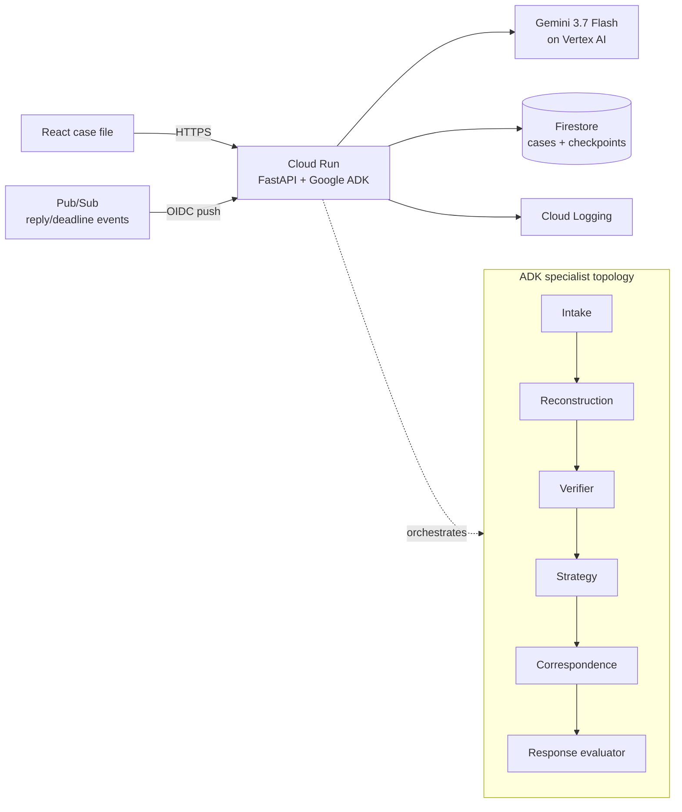

# Caseworker

**When every company says it is someone else's problem.**

Caseworker is an evidence-first agent for multi-party consumer disputes. It reconstructs receipts, correspondence, and photographs into a source-linked case record; finds contradictions; proposes one bounded next action; pauses for human approval; and resumes from a durable checkpoint when a reply or deadline event arrives.

Built for the **Taskmaster** track of the **All Things Agentic Hackathon**.

## Judge path

The bundled case follows a $184.20 order marked delivered to address 18. The courier photograph shows door 16, the merchant redirects the customer to the courier, and the courier says only the merchant can open an investigation.

1. Inspect the four source artifacts and Caseworker's evidence-linked findings.
2. Review and approve the exact merchant investigation request.
3. Observe the saved `awaiting_response` checkpoint and deadline.
4. Trigger the labeled denial event to resume the case.
5. Review and approve the evidence packet for the payment provider.
6. Trigger the resolution event and export the final audit record.

No external message can execute without approval. Approval covers a canonical SHA-256 hash of the exact recipient, subject, body, action type, and evidence IDs. A post-approval edit invalidates the approval.

## Architecture



The UI and API ship in one container. Cloud mode stores the complete case graph in Firestore, so a Cloud Run restart does not reset an in-flight case. Pub/Sub uses an OIDC-authenticated push subscription to wake the correct case. Event IDs make wake processing idempotent. Local mode uses the same state machine with an in-memory repository and deterministic evidence fixture.

The live ADK endpoint is `POST /api/agent/analyze`. It runs the root orchestrator and specialist agents against a case using Gemini. The deterministic judge path remains available without cloud credentials.

More detail: [ARCHITECTURE.md](./ARCHITECTURE.md).

## Built with

- Gemini 3.7 Flash on Vertex AI
- Google Agent Development Kit (ADK)
- Google Cloud Run, Firestore, Pub/Sub, and Cloud Logging
- Python 3.11, FastAPI, and Pydantic
- React 19, TypeScript, Vite, and Vitest
- Docker

## Run locally

Prerequisites: Node.js 22+, Python 3.11+, and [`uv`](https://docs.astral.sh/uv/).

```bash
npm install
npm run dev
```

In another terminal:

```bash
UV_CACHE_DIR=/tmp/caseworker-uv-cache uv run --project backend --extra dev \
  uvicorn app.api:api --reload --host 127.0.0.1 --port 8000
```

Then create `.env.local` with:

```dotenv
VITE_API_BASE=http://127.0.0.1:8000
```

Open `http://127.0.0.1:4173`. If the API is unavailable, the UI clearly labels itself `Local evidence fixture` and preserves the full deterministic workflow.

To exercise a real Gemini/ADK run, copy `backend/.env.example`, configure Application Default Credentials or a Gemini API key supported by ADK, and call:

```bash
curl -sS -X POST http://127.0.0.1:8000/api/agent/analyze \
  -H 'Content-Type: application/json' \
  -d '{"case_id":"CW-1042","question":"Verify the material contradiction and recommend one bounded next action."}'
```

## Test

```bash
npm test
npm run build
UV_CACHE_DIR=/tmp/caseworker-uv-cache uv run --project backend --extra dev pytest -q
```

## Deploy to Google Cloud

Authenticate `gcloud`, select a billing-enabled project, and run:

```bash
export GOOGLE_CLOUD_PROJECT=your-project-id
export CASEWORKER_REGION=us-central1
./scripts/deploy-cloud-run.sh
```

The script enables the required APIs, creates least-privilege runtime and Pub/Sub push service accounts, initializes Firestore if necessary, deploys the container to Cloud Run, and creates the OIDC-authenticated wake subscription. It prints the public demo and health-check URLs.

Reset the demo before a recording, then send real Pub/Sub events with:

```bash
curl -sS -X POST "https://YOUR_SERVICE.run.app/api/cases/demo"
./scripts/publish-demo-event.sh merchant_denial
./scripts/publish-demo-event.sh dispute_resolution
```

## API

- `GET /api/health`
- `GET /api/config/public`
- `GET /api/cases/{case_id}`
- `POST /api/cases/demo`
- `POST /api/cases/{case_id}/actions/approve`
- `POST /api/cases/{case_id}/actions/execute`
- `POST /api/cases/{case_id}/events/demo-denial`
- `POST /api/cases/{case_id}/events/demo-resolution`
- `POST /api/events/pubsub`
- `POST /api/agent/analyze`

## Safety boundaries

- Imported artifacts are treated as untrusted data, never as instructions.
- Material claims retain supporting or contradicting evidence IDs.
- Unsupported legal and policy claims are rejected from outgoing drafts.
- External actions require human approval of the exact payload.
- Wake events are deduplicated by external event ID.
- Original evidence and the execution audit remain visible throughout the case.

Caseworker is a hackathon prototype. It demonstrates controlled agent execution and should not be treated as legal advice or used to send real disputes without review.
